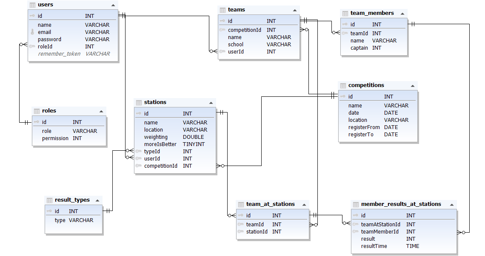

## Diagram

 
# Táblák
 
<h1 style="text-align:center;">Users</h1>
 
><strong> id :</strong> *A felhasználó azonosítója, int(10), autoIncrement*
 
><strong> username(Név) :</strong> Itt van a felhasználónév, string(25), notNull
 
> **roleID()** -> A szerepkörhöz tartozó jogok [1 (regisztráló), 2 (felügyelő), 3 (admin)]
 
<h1 style="text-align:center;">Szerepkörök [Roles]</h1>

> **id(azonosító)** -> A szerepkör azonosítója
 
> **role(szerepkör)** -> Itt vannak a szerepkörök, string(10), notNull
 
> **permission(jog)** ->  A szerepkörrel megegyező jogot biztosít
  
<h1 style="text-align:center;">Csapatok [Teams]</h1>
 
> **id** -> a csapatok id-je
 
> **competitionId(versenyId)** -> A verseny Id-je
 
> **teamName(csapatNev)** -> A csapatok neve(i)
 
> **school(iskola)** -> Az iskola neve
 
<h1 style="text-align:center;">Állomások [Stations]</h1>
 
> **azonosító(id)** -> Az állomások azonosítója(id)
 
> **stationName(állomásNév)** -> Az állomás neve
 
> **location(hely)** -> A terem neve
 
> **weighting(súlyozás)** -> Az állomás pontjainak súlyozása
 
> **moreIsBetter(többAjobb)** -> A verseny típusától függ a pontozás
 
> **resultTypeId(eredményTípusId)** ->  A típus azonosítója(id)
 
> **userId** -> A felhasználó azonosítója(id)
 
> **competitonId(versenyId)** -> A verseny azonosítója(id)
 
<h1 style="text-align:center;">Csapattagok [teamMembers]</h1>
 
> **id(azonosító)** -> A csapattagok azonosítója(id)
 
> **teamId(csapatId)** -> A csapat azonosítója(id)
 
> **name(név)** -> A csapattagok nevei
 
> **teamCaptain(csapatkapitány)** -> A csapatkapitány neve
 
<h1 style="text-align:center;">eredményTípusok [resultType]</h1>
 
> **id(azonosító)** -> Az eredményTípusok azonosítója(id)
 
> **resultType(eredményTípus)** -> Az eredmény típusa
 
### csapatAzÁllomáson [teamAStation]
<h1 style="text-align:center;">csapatAzÁllomáson [teamAStation]</h1>
 
> **id(azonosító)** -> A csapatAzÁllomáson azonosítója(id)
 
> **teamId(csapatId)** -> A csapat azonosítója(id)
 
> **stationId(állomásId)** -> Az állomás azonosítója(id)
 
### versenyek [competitions]
<h1 style="text-align:center;">versenyek [competitions]</h1>
 
> **id(azonosító)** -> A verseny azonosítója(id)
 
> **competitonName(versenyNév)** -> A verseny neve
 
> **competitonDate(versenyDátum)** -> A verseny megrendezésének dátuma
 
> **competitonLocation(versenyHelyszín)** -> A vereny helyszíne(iskola)
 
> **registerFrom(regisztrációTól)** -> A regisztráció kezdete
 
> **registerTo(regisztrációIg)** -> A regisztráció vége
 
 
### tagokEredményeiAzÁllomáson [memberResultsAtStation]
<h1 style="text-align:center;">tagokEredményeiAzÁllomáson [memberResultsAtStation]</h1>
 
> **id(azonosító)** -> A tagok eredményeinek azonosítója(id)
 
> **teamAtStation(csapatAzÁllomáson)** -> Az adott csapat, amelyik részt vett az állomáson
 
> **teamMemberId(csapattagId)** -> A csapattag azonosítója(id)
 
> **result(eredmény)** -> Az adott csapattag eredménye az állomáson
 
> **resultTime(eredményIdő)** -> Az eredmény elérése közben mért idő